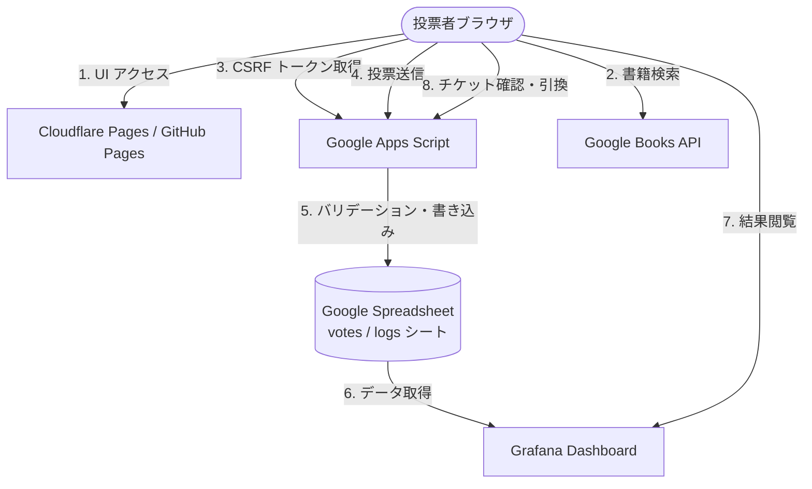

# Biblivote システム仕様

Biblivote は [クラウドネイティブ会議 2026](https://cloudnativedays.jp/archives/cloudnativekaigi2026/)（2026年5月14〜15日、名古屋）の書店コーナー向けに構築された技術書投票・可視化 Web アプリケーションです。

---

## 1. システム概要

参加者がアンケートフォームから技術書の読書スタイル・推し本を投票し、結果を Grafana でリアルタイム可視化してクロージングセッションで発表します。投票完了者には書店コーナーで栞をプレゼントするスライドチケット機能を備えています。

### 技術スタック

| レイヤ | 技術 |
|:---|:---|
| フロントエンド | Vanilla JS / Alpine.js (CDN) — ビルドステップなし |
| バックエンド | Google Apps Script (GAS) |
| データベース | Google Spreadsheet（votes / logs シート） |
| ホスティング | GitHub Pages / Cloudflare Pages（静的ファイル）|
| Docker | nginx:1.27-alpine — 環境変数を起動時に注入 |
| 書籍検索 | Google Books API（クライアント直接呼び出し）|
| セキュリティ | reCAPTCHA v3 / FingerprintJS v3 / CSRF Token / Honeypot |
| 可視化 | Grafana（Spreadsheet プラグイン）|

---

## 2. アーキテクチャ

### 2.1 コンポーネント図



### 2.2 設計方針（ADR サマリ）

| ADR | 決定 | 理由 |
|---|---|---|
| ADR-001 | Alpine.js でウィザード UI | ビルドなし CDN のみ。バニラ JS との親和性 |
| ADR-002 | GAS バックエンド | 追加コスト $0、Spreadsheet 直書き込み |
| ADR-003 | Google Books API をクライアントから直接呼出 | サーバー中継不要。300ms デバウンス＋インメモリキャッシュで負荷軽減 |
| ADR-004 | 多層不正防止 | reCAPTCHA v3 + FingerprintJS + CSRF + Honeypot の4層 |
| ADR-005 | Cloudflare Pages で静的ホスティング | CSP ヘッダーのカスタム設定、CDN 配信 |
| ADR-006 | スライドチケット（投票者デバイス完結） | 追加インフラゼロ。店員不在でも確認可能 |

---

## 3. 機能要件

### 3.1 投票フロー（ウィザード形式）

| ステップ | 内容 | 仕様 |
|---|---|---|
| TOP | 説明・開始ボタン | — |
| Q1 | ジャンル選択 | 9カテゴリから複数選択 |
| Q2 | 読書媒体 | 紙派 / 電子派 / 両方（選択で即次へ）|
| Q3 | 月間冊数 | 0〜99 の整数（ステッパー操作）|
| Q4 | 推し本 | Google Books API リアルタイム検索 |
| Q5 | おすすめ本 | Google Books API リアルタイム検索 |
| Q6 | イベント登録状況 | Yes/No。No の場合は登録リンクを表示 |
| 完了 | 完了メッセージ | Grafana リンク・SNS シェア・スライドチケット |

### 3.2 栞プレゼントスライドチケット機能

投票完了者が書店コーナーで栞と交換するための電子チケット機能。

**データモデル（votes シート）**

| 列 | 内容 | 型 |
|---|---|---|
| A | タイムスタンプ | ISO 文字列 |
| B〜I | 投票データ（Q1〜Q6）| 各種 |
| J | voteId | UUID v4 |
| K | redeemed | boolean（初期: false）|

**API エンドポイント**

| エンドポイント | メソッド | 説明 |
|---|---|---|
| `?action=token` | GET | CSRF トークン発行 |
| `?action=check_ticket&voteId=<UUID>` | GET | チケット状態確認 |
| `{ action: "redeem", voteId: "<UUID>" }` | POST | 栞引換（false→true のみ）|

**チケット表示状態**

| 状態 | 表示 |
|---|---|
| voteId なし | チケット非表示 |
| 未引換 かつ 開店時間内 | スライダー表示（スタッフ確認後に操作）|
| 未引換 かつ 開店時間外 | グレーアウト「書店コーナー受付時間外です」|
| 引換済み（redeemed=true）| 「交換済み ✅」|

**時間管理**

開閉店時刻は GAS スクリプトプロパティで設定。未設定時は常に時間内（開発フォールバック）。

```
STORE_OPEN_ISO  = 2026-05-14T10:00:00+09:00
STORE_CLOSE_ISO = 2026-05-15T18:00:00+09:00
```

**排他制御**

`action=redeem` は `LockService.getScriptLock().waitLock(30000)` で排他制御。スライドの二重送信による二重引換を防止。

**状態の永続化**

- `biblivote_vote_id` — localStorage に voteId を保存
- `biblivote_redeemed` — localStorage に引換状態をキャッシュ（リロード後のフリッカー防止）
- 真の状態はスプレッドシートの `redeemed` カラムが正。localStorage はキャッシュ用途のみ

### 3.3 セキュリティ対策

| 対策 | 実装箇所 |
|---|---|
| CSRF 保護 | `doGet?action=token` でワンタイムトークン発行、`doPost` で検証 |
| Bot 検出 | reCAPTCHA v3（スコア ≥ 0.5）＋不可視ハニーポットフィールド |
| 重複防止 | クライアント: `biblivote_voted` (localStorage) / サーバー: FingerprintJS ハッシュを logs シートで照合 |
| 入力バリデーション | GAS バックエンドでホワイトリスト検証 |
| voteId 推測防止 | UUID v4（2¹²² 通り）|
| 二重引換防止 | LockService 排他制御 ＋ redeemed 再確認チェック |

---

## 4. GAS スクリプトプロパティ一覧

| プロパティ名 | 必須 | 説明 |
|---|---|---|
| `SPREADSHEET_ID` | ✅ | 対象 Google Spreadsheet の ID |
| `RECAPTCHA_SECRET` | ✅ | reCAPTCHA v3 シークレットキー（GAS のみ、フロントエンド不可）|
| `STORE_OPEN_ISO` | 推奨 | 書店コーナー開店時刻（JST ISO 8601）未設定時は常に時間内 |
| `STORE_CLOSE_ISO` | 推奨 | 書店コーナー閉店時刻（JST ISO 8601）未設定時は常に時間内 |

---

## 5. フロントエンド環境変数

`window.*` 変数として `index.html` に注入（`scripts/inject-env.js` または Docker `entrypoint.sh`）。

| 変数名 | 必須 | 説明 |
|---|---|---|
| `GAS_ENDPOINT` | ✅ | GAS Web App URL |
| `RECAPTCHA_SITE_KEY` | 推奨 | reCAPTCHA v3 サイトキー（公開鍵）|
| `GOOGLE_BOOKS_API_KEY` | 任意 | Google Books API キー（未設定でも動作、制限緩和用）|
| `GRAFANA_URL` | 推奨 | Grafana ダッシュボード URL |
| `REGISTER_URL` | 任意 | イベント登録ページ URL |
| `SHARE_TEXT` | 任意 | SNS シェアテキスト（URL エンコード済み）|

---

## 6. SLO（サービスレベル目標）

| 目標 | 指標 | 目標値 |
|:---|:---|:---|
| 可用性 | 成功リクエスト率（4xx/5xx 除く）| **99.0%** |
| 書籍検索レイテンシ | P95 レスポンスタイム | **< 1,000ms** |
| 投票 API レイテンシ | P95 GAS 実行時間 | **< 3,000ms** |
| 引換 API レイテンシ | P95 GAS 実行時間 | **< 3,000ms** |
| ダッシュボード可用性 | Grafana ページアップタイム | **99.0%** |

---

## 7. セキュリティ監査サマリ（2026-04-22）

- **評価**: 重大な脆弱性なし
- **確認済み項目**: voteId 列挙不可（UUID v4）/ CSRF 不成立（SOP + Cookie レス GAS）/ XSS なし（Alpine.js x-text 自動エスケープ）/ シークレット露出なし（GAS スクリプトプロパティ管理）/ 二重引換なし（LockService）
- **受容済みリスク**: localStorage 消去によるチケット喪失（運用対応）/ voteId なし旧投票のチケット非対応（周知対応）
- 詳細: [docs/security/](./security/)
