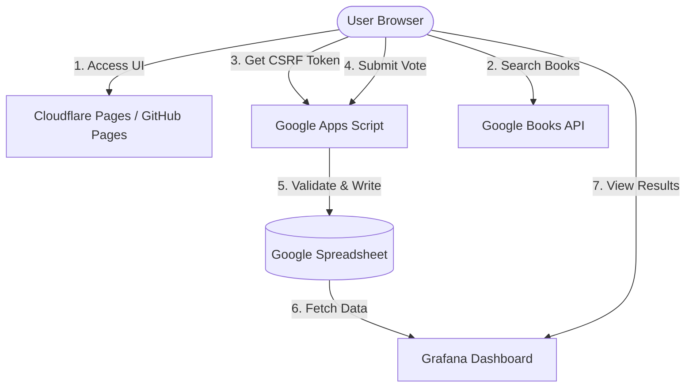

# Biblivote System Specification

Biblivote is a technical book voting and visualization web application designed for the "Bookstore Corner" at **CloudNative Kaigi 2026** (May 14-15, 2026, Nagoya).

## 1. System Overview

The system collects votes from participants (and non-participants) about their technical book preferences. Results are visualized in real-time via a Grafana dashboard and presented during the closing session of the event.

### Tech Stack

| Layer | Technology |
| :--- | :--- |
| **Frontend** | Vanilla JS / Alpine.js (CDN) |
| **Backend** | Google Apps Script (GAS) |
| **Database** | Google Spreadsheet |
| **Hosting** | GitHub Pages / Cloudflare Pages |
| **Book Search** | Google Books API |
| **Security** | reCAPTCHA v3 / FingerprintJS / CSRF Token / Honeypot |
| **Visualization** | Grafana (Spreadsheet plugin) |

---

## 2. Architecture & Design

### 2.1 Component Diagram

### 2.2 Key Decisions (Summary)

Detailed decisions can be found in the [ADR directory](./adr/).

- **ADR-001 (Frontend)**: Alpine.js for lightweight wizard-style UI state management.
- **ADR-002 (Backend)**: Google Apps Script for zero-cost, serverless handling of spreadsheet writes.
- **ADR-003 (Book Search)**: Direct client-side calls to Google Books API with debouncing (300ms) and in-memory caching.
- **ADR-004 (Anti-Fraud)**: Multi-layered approach: reCAPTCHA v3, FingerprintJS, CSRF tokens, and localStorage flags.
- **ADR-005 (Hosting)**: Static hosting on Cloudflare Pages for performance and CSP header support.

---

## 3. Functional Requirements

### 3.1 Voting Flow (Wizard Style)

1.  **TOP**: Introduction and "Start" button.
2.  **Q1 (Genres)**: Multi-select from 9 technical genres.
3.  **Q2 (Format)**: Single-select (Paper / Digital / Both). Auto-advances.
4.  **Q3 (Reading Volume)**: Numeric input (0-99) with stepper.
5.  **Q4 (Best Book)**: Real-time search using Google Books API.
6.  **Q5 (Recommendation)**: Real-time search using Google Books API.
7.  **Q6 (Registration Status)**: Yes/No. If No, displays event registration link.
8.  **Complete**: Success message, Grafana link, and SNS share button.

### 3.2 Security Measures

-   **CSRF Protection**: One-time tokens issued via `doGet?action=token` and verified in `doPost`.
-   **Bot Detection**: reCAPTCHA v3 (Score >= 0.5 required) and a hidden "honeypot" field.
-   **Duplicate Prevention**:
    -   Client-side: `biblivote_voted` flag in `localStorage`.
    -   Server-side: FingerprintJS hash checked against logs in the spreadsheet.
-   **Input Validation**: Strict schema and whitelist validation in GAS backend.

---

## 4. SLO (Service Level Objectives)

| Objective | SLI (Indicator) | Target |
| :--- | :--- | :--- |
| **Availability** | Success / Total attempts (excluding 4xx/5xx) | **99.0%** |
| **Book Search Latency** | P95 Response Time | **< 1,000ms** |
| **Voting Latency** | P95 GAS Execution Time | **< 3,000ms** |
| **Dashboard Availability** | Dashboard page up-time | **99.0%** |

---

## 5. Security Audit Summary (2026-04-04)

-   **Rating**: 4/5 (Minor concerns).
-   **Highlights**:
    -   No critical vulnerabilities found in production dependencies.
    -   Security headers (CSP, X-Frame-Options, etc.) are properly configured.
    -   All inputs are sanitized; `textContent` is used over `innerHTML`.
-   **Main Recommendations**:
    -   Ensure `credentials.json` is not committed.
    -   Implement HSTS in `_headers`.
    -   Monitor for bot activity via GAS execution logs.
